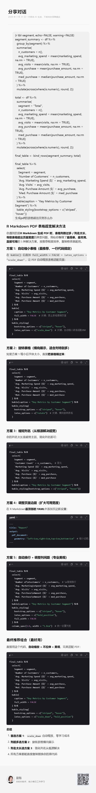

## **The usage of AI**

I utilized artificial intelligence tools to assist with resolving the table formatting issue, specifically addressing the problem of wide table columns exceeding the page width. The final solution implemented was **shortening the column names** to optimize the table layout and ensure proper fit within the PDF document.

{fig-align="center"}
